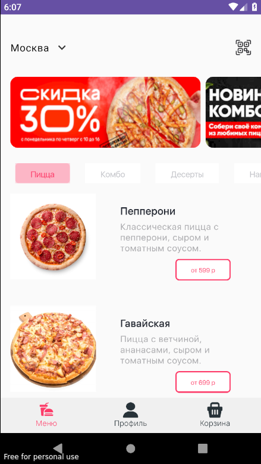
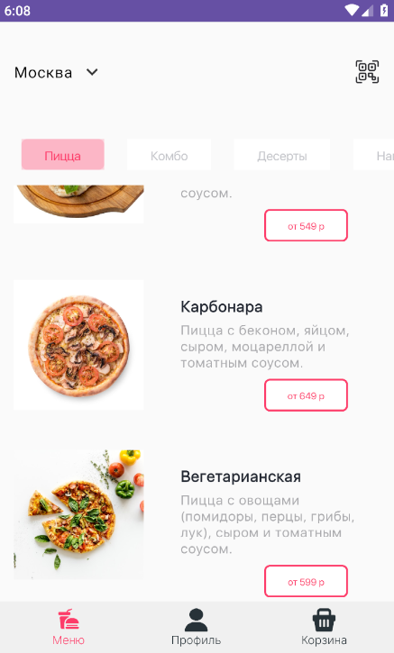
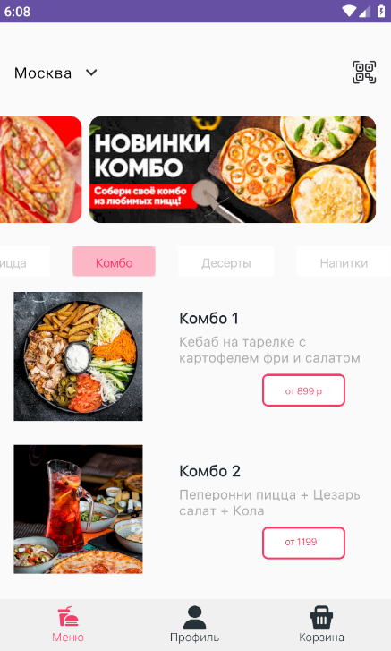
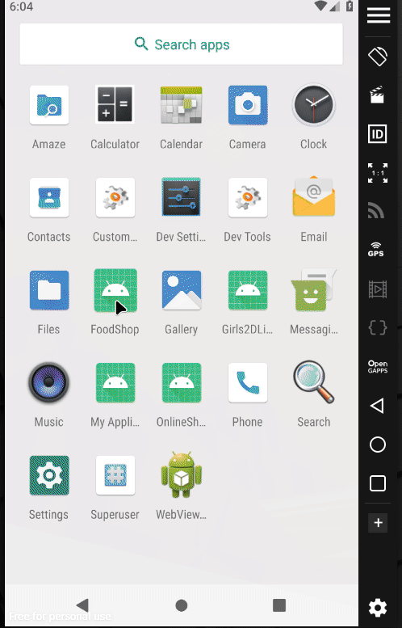

# FoodShop app

## Что это за приложение?

Приложение выполнено в рамках тестовое задания компании HammerSystems

## UI скриншот

|                   | Portrait                                                     | 
|-------------------|--------------------------------------------------------------|
| main screen       |              |                                                                       |
|                   |              |                                                                       |
|                   |              |                                                                       |
| gif               |      |                                                                       |

## использованные технологии

1. Jetpack Compose
2. Navigation
3. API Calls using Retrofit
4. Clean Architecture
5. DI Koin

## Использованно Api

**https://run.mocky.io/v3/18c6724c-b77b-45cd-ba10-7ed189d98a53**

